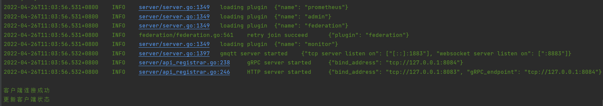

### 功能介绍
Gmqtt 插件开发，实现以下功能：当客户端连接成功后生成记录，当客户端断开连接后更新记录状态。实现此功能需监听两个事件OnConnected、OnClosed。

### 怎么写插件

可以使用gmqctl命令行工具，gmqctl有生成插件模板这一个功能。

```
#生成 gmqctl
cd D:\work\gmqtt_plugin\cmd\gmqctl
go build

#生成插件
gmqctl gen plugin -n monitor -H OnConnected,OnClosed -c true -o ../../plugin/monitor

#上述命令会在plugin目录下生成如下几个文件：
D:\work\gmqtt_plugin\plugin\monitor> tree /f
卷 Data 的文件夹 PATH 列表
卷序列号为 E0AA-CAE3
D:.
    config.go
    hooks.go
    monitor.go

没有子文件夹
```
### 建表sql
```sql
create table `client` (
	`id` int (11) comment '主键',
	`name` varchar (100) comment '客户端名称',
	`ip` varchar (50) comment '客户端IP',
	`status` tinyint (1) comment '客户端状态 1 在线 2 离线',
	`created_at` datetime comment '创建时间',
	`updated_at` datetime comment '更新时间',
	`deleted_at` datetime comment '删除时间' 
) comment '客户端'; 
```
### 运行效果

